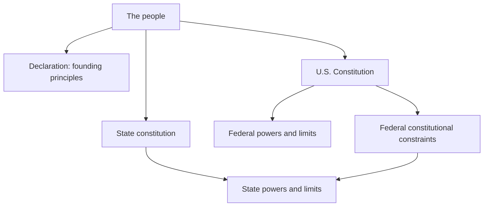

# Authority-to-Remedy Trace: legal foundation and route specification

Research checkpoint: 9 October 2026 UTC (8 October 2026 in New York). Educational architecture, not an assessment of any person's case. Primary-source register: legal_sources.json. Florida sources retrieved from the official 2026 statutes and rules compilations updated 1 October 2026. U.S. Code sources identify their retrieved edition. For a real filing, confirm controlling text on the event date, later amendments, governing decisions, local rules, and the actual docket.

## 1. The narrow model

The unit of analysis is **one consequential act or omission by one identified authority holder**, at one procedural stage, affecting an identified person's legally protected interest. It is not a verdict on an institution or a person's motives.

A trace contains two connected paths:

1. **Permission to act:** constitutional allocation -> enacted authority -> assigned actor -> jurisdiction -> factual and procedural predicates -> decision -> consequence.
2. **Permission to obtain a remedy:** protected interest -> alleged defect -> evidence -> applicable claim or motion -> competent forum -> sufficient filing and service -> finding -> authorized relief -> implementation.

A missing link is an investigation question. It is not automatically proof of illegality, criminal intent, lack of subject-matter jurisdiction, or a void order. Those conclusions have separate legal tests.

Recommended public name: **Authority-to-Remedy Trace**. The operative question is: **Who must do what, after which legally established conditions, in which forum, and what record proves completion?**

Use the user's cycle with explicit meanings:

| Step | Meaning in this model | Output |
|---|---|---|
| Record | Preserve lawfully obtained observations and original records, distinguishing firsthand facts, reports, inference and uncertainty. | Event ledger and evidence index. |
| Classify | Compare a specific action or omission with a sourced requirement; mark supported, disputed, missing, inapplicable or unknown. | Predicate matrix; an alleged defect is not an adjudicated violation. |
| Obligate | Invoke an **existing** duty through the process the applicable law recognizes. | Proper application, motion, petition, objection or other recognized vehicle plus proof of submission/service. |
| Enforce | Ask a body with authority for the particular relief to exercise its lawful power. | Ruling or order, or a documented denial with an available review route. |
| Remedy | Verify implementation of the authorized relief and identify any still-operative downstream consequences. | Completion evidence; unresolved consequences go to their proper decision owner. |

Sending a private accusation, affidavit, demand or deadline does not by itself create jurisdiction, establish liability, make silence an admission, compel prosecution, or impose a legally binding remedy. An affidavit is evidence only to the extent the relevant rules allow; it is not a judgment.

## 2. The people and the constitutional structure

| Layer | Accurate role | What the website should show |
|---|---|---|
| People / Declaration | The Declaration expresses foundational legitimacy and consent principles. The National Archives expressly distinguishes it from legally binding founding documents. [declaration] | A historical-principles panel, visually distinct from enforceable authorities. Do not make it the cause-of-action node. |
| U.S. Constitution | Articles I, II and III distribute federal powers. Article VI establishes constitutional supremacy and binds relevant officials by oath. [constitution] | Federal legislative, executive and judicial branches; each specific office must still identify its operative authority. |
| Reserved powers and retained rights | The Tenth Amendment reserves undelegated powers; the Ninth cautions against treating enumerated rights as exhaustive. The First includes petition; the Fifth constrains federal deprivations. [bill_of_rights] | Parallel state authority, not states as subordinate federal departments. A personal withdrawal of consent is not a jurisdictional switch. |
| State constitutional structure | Florida Article I §1 locates political power in the people; §§9 and 21 address due process and access to courts. Article V distributes state judicial power. [fl_constitution] | State constitutional -> state legislative -> agency/court branches. |
| Federal constitutional constraint on states | The Fourteenth Amendment restricts state deprivation of life, liberty or property without due process and requires equal protection. [fourteenth] | A constraint across state action, not a promise that any complaint can bypass state procedure. |
| Operative law and precedent | The relevant statute, regulation, court rule, binding precedent and operative order provide the action-specific conditions. | Every assertion links to source, pinpoint, jurisdiction, effective date and applicability. Policy manuals are separately labeled. |
| Remedy authority | A legal duty and a private right to sue over its breach are separate questions. | Separate nodes for duty, protected right, cause of action, jurisdiction, waiver/immunity and remedy. |

Illustrative topology, not a complete legal hierarchy:

The classroom should teach **delegation and constraint**, not an assumption that every government relationship can be represented by one linear command chain.

## 3. A requirement card suitable for software

| Field | Required content |
|---|---|
| Decision | One sentence naming the action or omission and its real consequence. |
| Actor | Person, office, role, capacity and source of assignment. |
| Legal source | Official URL, title, section/subsection, operative language, version and effective date. |
| Authority type | Constitution, statute, regulation, binding decision, court rule, operative order, or nonbinding guidance. |
| Scope | Federal/state/tribal/local; subject matter; geography; affected persons; procedural stage. Tribal and interstate jurisdiction require separate modules. |
| Duty type | Mandatory; mandatory if conditions established; discretionary; prohibited; or proposed safeguard. “Shall” is a starting clue, not the entire enforceability analysis. |
| Predicate | Each condition, all/any logic, exceptions, who must establish it, and applicable evidentiary standard. |
| Evidence | Record ID supporting or contradicting each predicate, source reliability, admissibility question, and unknowns. |
| Trigger | Event, receipt, service, finding or order that legally starts the duty. Receipt by an arbitrary official is not necessarily a valid trigger. |
| Required output | Exact legally required act/document; owner; audience; required contents; method of service or publication. |
| Time | Source-derived time rule, start event, calendar/business-day distinction, extensions, tolling and exceptional branches. Never infer a filing deadline from a generic example. |
| Alleged defect | Factual error, missing predicate, excess authority, deficient procedure, delay, noncompliance with an order, or other defined issue. |
| Remedy basis | Specific power authorizing the requested relief and any limitations. |
| Forum and vehicle | Proper tribunal, existing/new docket, motion/petition/notice/complaint, party standing, service and record requirements. |
| Resolution | Ruling, reasons, relief, implementation owner and proof. |
| Correction reach | Which recipients and later decisions depend on the disputed fact; label broader propagation controls proposed unless law/order actually requires them. |
| Validation | Researcher, reviewer, review date, unresolved legal questions, and superseded versions. |

Do not combine “evidence not available to the learner” with “evidence does not exist.” Both must remain distinct from “legally insufficient evidence.”

## 4. Legally required, discretionary and proposed controls

| Situation | Duty / discretion distinction | Required or possible output | Source |
|---|---|---|---|
| A qualifying matter presented to a federal agency | Agency must conclude it within a reasonable time. A specific governing enactment may provide a different deadline. | Disposition of the matter; no general APA rule automatically supplies a fixed number of days for every request. | 5 USC §555(b). [apa_555] |
| Denial of a qualifying written agency application, petition or request | Prompt notice is required; brief grounds ordinarily accompany it. | Denial notice and grounds; reasons exception when affirming a prior denial or denial is self-explanatory. | §555(e). [apa_555] |
| An interested person's federal rulemaking petition | A petition right exists within §553's applicability; adoption of the requested rule is not promised. | Properly routed petition and agency handling under applicable law. | §553(a), (e). [apa_553] |
| A federal agency allegedly fails a legally required discrete act | A potential §706(1) route; broad claims that an agency should improve its overall program are insufficient. | If the claim succeeds, an order compelling the act; lawful discretion over the merits can remain. | §706(1); Norton, 542 US at 64–65. [apa_706] [norton] |
| Florida dependency review: court finds agency failed written case-plan obligations | Court may use contempt; the compliance-plan and explanation requirements are mandatory after that finding. | Agency plan for compliance and showing why the child could not safely return. | Fla Stat §39.701(2)(d)3. [fl_39_701] |
| A network-wide corrected-data receipt | No universal duty is established by this memo. | Recipient acknowledgment, dependency map, reassessment queue and closure dashboard are proposed assurance controls unless separately mandated. | Proposed design. |

## 5. Federal example: an unresolved required agency decision

**Classroom scenario:** A person properly submitted a complete application to a federal agency. For the exercise, a supplied governing rule requires that agency to decide that application. The agency has neither decided nor denied it. The agency, application and specific deadline are deliberately unspecified: inserting them without a verified source would turn a sound framework into false legal guidance.

A useful actual-law variant is a qualifying rulemaking petition under §553(e), after checking applicability and the agency's petition regulations. The petition can request action; it cannot force the requested policy outcome. [apa_553]

| Stage / trigger | Actor and legal question | Required output or learner document | Time / exception | Where a failure is raised |
|---|---|---|---|---|
| 1. Identify decision duty | Does the subject statute or regulation require this identified federal agency to make this particular decision? | **Learner:** duty card attaching the exact operative provision and predicates. | Use its actual effective version. | Agency-specific application route first. |
| 2. Present qualifying matter | Applicant follows the prescribed form, recipient, completeness and fee requirements. | **Learner:** application/petition plus receipt and completeness evidence. A receipt is evidence; the APA does not create a universal receipt form. | Start event comes from the governing rule. | Correct agency office/docket. |
| 3. Await required action | §555(b) applies to conclusion within reasonable time, read with the particular program law. | **Agency:** decision required by that law, in the form that law specifies. | Reasonableness is contextual when no specific deadline applies. | Authorized status or administrative review channel. |
| 4. If denied | A qualifying written request connected to an agency proceeding was denied. | **Agency:** prompt denial notice, ordinarily with brief grounds. | §555(e) reasons exceptions apply. | Agency appeal/reconsideration if applicable; later judicial review if available. |
| 5. If still not acted upon | Identify a discrete, legally required act, duration, prejudice and explanations. | **Learner:** delay chronology and precise requested act; optional status request is not a universal prerequisite or deadline reset. | Not every delay is unlawful. | Forum determined by the governing review statute. |
| 6. Check review gates | Federal agency status; standing; reviewability; proper defendant; jurisdiction; waiver; venue; prescribed administrative process; special statutory review. | **Learner:** route eligibility record. | Do not invent blanket exhaustion or finality rules. A failure-to-act claim needs its own analysis. | Statutorily assigned court; sometimes direct court-of-appeals review, otherwise a properly grounded district-court action. |
| 7. Seek compulsion | Where authorized, plead the legally required discrete act and actual failure/delay. | **Litigant:** complaint or petition appropriate to that forum, supporting record and required service; motion for interim relief only if its separate requirements are met. | Applicable filing, service and motion rules control. | Competent court. |
| 8. Resolve and implement | Court determines eligibility and merits; successful compulsion is bounded by lawful discretion. | **Court:** order specifying what must occur; **agency:** required action; **learner:** compliance evidence. | Court order and governing program law control. | Original enforcing forum; appeal of a reviewable ruling through its proper route. |

Source boundaries: §§551 and 701 govern the agency/scope questions; §702 addresses eligible review and nonmonetary-relief waiver; §704 addresses statutorily reviewable/final action and adequate alternative remedies; §706 differentiates inaction review from review of completed action. These provisions do **not** turn the Florida dependency court or DCF into a federal APA agency. [apa_551] [apa_701] [apa_702] [apa_704] [apa_706]

28 USC §1331 is a federal-question jurisdiction provision; §1361 concerns actions in the nature of mandamus against federal officers/employees/agencies. Neither eliminates the need to establish the claim's other requirements. A mandamus label is not interchangeable with an ordinary appeal. [federal_question] [mandamus]

## 6. Florida example: trace the dependency docket and an agency service failure

**Classroom scenario:** An existing Florida Chapter 39 case has an approved written case plan. The agency has an identified service obligation. The parent documents timely attempts, provider unavailability and notices to the responsible caseworker. The exercise asks for an accurate judicial-review record and the court's assessment of compliance. It does not assume the parent has proved every return-home condition.

The entry forum is the existing circuit dependency docket under Chapter 39, subject to any controlling jurisdiction issues. In Hillsborough County this is the Thirteenth Judicial Circuit; qualifying appellate review goes to the Second District Court of Appeal. Federal litigation has separate requirements and is not the next box on that appeal ladder. [fl_39_013] [fl_second_dca]

### Baseline government document sequence

| Trigger | Responsible actor / duty | Required output to look for | Provision and timing / branch | Route for alleged failure |
|---|---|---|---|---|
| Officer takes child into custody | Officer states removal facts when delivering to DCF; written report follows. | Facts supporting custody plus full written report to department. | §39.401(2): report within 3 days after release or delivery. | Shelter record; counsel; appropriate evidentiary challenge. |
| DCF agent receives/takes custody | Review facts with department attorney for shelter probable cause. | If insufficient, immediate return; if sufficient and child not returned, petition and scheduled hearing. | §39.401(3); attorney requests hearing within 24 hours of removal. | Shelter hearing; preserve relevant facts. |
| Proposed continued shelter | Petitioner/court must address statutory placement predicates, notice and findings. | Shelter petition; hearing; shelter order with required findings. | §39.402(1)–(2), (5)–(8); more than 24 hours in shelter requires court order after hearing; examine authorized continuances. | Proper objection/evidence at shelter hearing; appropriate review route. |
| Shelter hearing concludes | Court sets review and notifies parties. | Written notice of next shelter-placement review. | §39.402(16): no later than 30 days after shelter placement, with arraignment; other hearings may be required. | Existing docket; record scheduling defect. |
| Adjudication of dependency sought | Petitioner identifies specific acts/omissions and relevant persons. | Written, sworn dependency petition; DCF attorney signs when DCF petitions. | §39.501(1), (3); related rule supplies content and timing. | Response, defenses and motions authorized at that stage. |
| Sheltered child / petition filed | Court conducts arraignment; parent admits, denies or consents. | Arraignment record and next-hearing setting. | §39.506(1): ordinarily within 28 days of shelter hearing; early-demand branch differs. Denial leads to adjudication; consent/admission leads to disposition. | Existing docket; notice and appearance questions must be preserved. |
| Contested dependency allegations | Court applies civil evidence rules and preponderance standard. | Dismissal if not dependent; otherwise appropriate findings and order, subject to authorized withholding of adjudication. | §39.507(1), (4)–(6). Anonymous-call evidence requires independent corroboration. | Objections and review appropriate to the entered order. |
| Disposition/case-plan stage | Department submits plan and assessment; court issues disposition. | Filed/served case plan and family functioning assessment; written disposition naming placement, conditions, service monitors and next review. | §39.521(1)(a), (b), (d), (e): 72-hour service provisions have different hearing branches; assessment exception requires court finding/order. | Case-plan/disposition hearing; supported request for correction or appropriate review. |
| Review becomes due / party seeks review | Court/clerk schedule; agency reports; required recipients receive notice/material. | Review notice; social-study report; properly served material; hearing. | §39.701(1)(d)–(f), (2)(a)–(b): initial review is bounded by 90-day/6-month triggers; listed reports generally at least 72 hours beforehand, with recipient exceptions. | Existing docket and Rule 8.415. |
| Review hearing concludes | Court records required facts, findings, future course and next hearing. | Written judicial-review order. | Rule 8.415(f)(7). | Proper rehearing, relief or review route according to defect and posture. |

Statutory links for those rows appear under source IDs fl_39_401 through fl_39_701 in legal_sources.json. The table is a map of checkpoints, not a calendar for any case.

### The service-failure exercise: learner document sequence

1. Obtain the operative case-plan version, service assignment, provider correspondence, relevant orders and existing hearing dates.
2. Create a factual ledger: required service, responsible actor, appointments requested/offered, actual availability, barriers, responses and resulting effects.
3. Make a predicate table distinguishing agency obligation, parent obligation, facts supporting noncompliance, contrary facts and missing records.
4. Through the authorized party/representative and local scheduling process, use the existing docket to seek judicial review or other appropriate postdisposition relief. Attach admissible/supportable materials and serve the required recipients. A letter alone is not the court motion.
5. At review, request specific findings about the agency obligation and documented failure, and identify the statutory requested output.
6. If the court makes the requisite noncompliance finding, track the compliance plan and explanation it orders; contempt is discretionary. Return-home relief requires its own safety findings, not merely proof that the agency missed a task.
7. Obtain the entered order and track actual service provision. A hearing being held is not proof the needed service became usable.

Steps 1–4 and 7 are proposed workflow organization. The substantive conditional output in step 6 is §39.701(2)(d)3; the court must separately determine the legally applicable return conditions. [fl_39_701]

### A treatment branch proves why one general “best interests” label is insufficient

Custody, medical screening, medical treatment and psychotropic medication have different authority and consent paths. Section 39.407(1) authorizes a qualifying screening but does not itself authorize treatment. Under the ordinary psychotropic-motion branch, §39.407(3)(c) requires a motion supported by department information and a signed prescriber report. Section (3)(d) sets notification and objection procedure; an objection triggers a hearing before authorization. Existing-medication and emergency branches have different requirements under (3)(b) and (e). The court's authorization remains conditioned on the statutory showing. [fl_39_407]

This branch should have its own route card. Do not place it on every dependency timeline as if it always occurs.

### Review guards that must remain visible

- **Current Rule 8.265:** rehearing is due within 10 days of rendition; it does **not** toll appeal time; the motion is deemed denied if not ruled on within 10 days of filing. Missing required final-order findings must be raised by rehearing to preserve that issue. [fl_juvenile_rules]
- **Current Rule 9.110(b):** a qualifying final-order appeal generally begins by notice filed with the lower-tribunal clerk within 30 days of rendition. Determine rendition and appealability from the actual order. Rule 9.146 modifies dependency appeals; Rules 9.130 and 9.100 govern different nonfinal/writ routes. [fl_appellate_rules]
- **No general automatic stay:** §39.510(3) and Rule 9.146(c) contain the relevant rule and a limited termination/adoption provision. Do not assume an appeal returns the child or suspends all proceedings. [fl_39_510]
- Statutory filing/notice language, local implementation, appellate preservation and an extraordinary writ are separate matters. A missed procedure does not automatically dictate the final remedy.

## 7. Routing: issue first, courthouse second

| Alleged problem | First routing question | Possible class of vehicle, only if authorized |
|---|---|---|
| Wrong fact in a pending dependency record | Who owns the record, and is a factual correction or judicial finding needed? | Supported record correction request, evidentiary objection, motion appropriate to the pending case. |
| Missing statutory finding in a final dependency order | Which finding is actually required, and how is error preserved? | Rule 8.265 rehearing/preservation, independently tracked appeal. |
| Agency has not performed written case-plan duty | Is that duty established and is judicial review pending/available? | Chapter 39 judicial review; findings and conditional relief. |
| Claimed excess jurisdiction | Which jurisdictional element is absent, and which tribunal may decide the challenge? | Proper jurisdictional motion, appeal or narrowly eligible writ; do not equate every error with jurisdictional absence. |
| Federal agency has not made a required decision | Is it an eligible federal agency and a legally required discrete act? | Program-specific review; potentially §706(1), with forum and other gates verified. |
| Completed federal agency decision allegedly unlawful | Is it reviewable action and is an adequate alternative remedy provided? | Applicable statutory review or APA action, subject to §704 and other requirements. |
| Federal right allegedly violated under color of state law | What specific federal right, defendant conduct and available relief are established? | Potential §1983 claim; it is not a generic appeal of the state order. |
| Misconduct complaint | Can this body investigate discipline, or can it actually change the challenged order? | Oversight/disciplinary complaint when within remit, alongside separately preserved adjudicative remedies. |

Article III standing includes concrete injury, traceability and redressability. [standing] Section 1983 concerns deprivation of federal rights under color of state law; not every statutory shortcoming supplies an enforceable federal right. The statute itself limits certain injunctive relief against judges. [section1983] Judicial damages immunity is a separate barrier with defined exceptions, not automatic impunity for every act. [judicial_immunity] Federal district courts have original jurisdiction and are not general appellate courts over adverse state judgments; the precise Rooker-Feldman boundary is narrow and independent claims need their own analysis. [state_judgment_review]

No generic filing sequence can guarantee jurisdiction, a hearing, damages, contempt, prosecution, reversal, return, or another desired outcome. Exhaustion, finality, immunity, abstention, preclusion, time limits and alternative remedies must be tested for the selected route. Avoid claiming every civil-rights claim requires state administrative exhaustion, or that no claim ever does.

## 8. Recording and teaching controls

“Record” should mean lawful documentation: contemporaneous notes, original correspondence, docket copies, authorized records and transcripts, and properly permitted audio/video. Florida §934.03(2)(d) provides an all-party prior-consent route for covered communications; other exceptions are fact-specific. Court recording rules and dependency confidentiality are separate. [fl_recording] [fl_39_0132]

Classroom practice should use fictional records and consensual simulation. Learners can practice:
- separating observation, allegation, inference and finding;
- finding the source and pinpoint;
- converting a requirement into conditions and exceptions;
- choosing the authorized procedural vehicle;
- identifying the exact output a successful request would require;
- proving service, ruling and implementation;
- revising the trace when new evidence contradicts the first theory.

Score source accuracy, predicate completeness, lawful record handling, appropriate forum and honest uncertainty. Do not score the exercise on whether the learner obtains a predetermined accusation or outcome.

## 9. Website and book guardrails

Use an educational blueprint with two worked route families, not a national filing generator claiming complete coverage.

Every route card should visibly distinguish:
- **Verified legal text and source date**
- **Research interpretation / unresolved applicability**
- **Proposed assurance control**
- **Fictional exercise facts**
- **Operational completion evidence**

A useful atlas is a graph of institutions **and their remedial powers**, with separate edges for appellate review, agency supervision, disciplinary oversight, records custody and federal original jurisdiction. Geographical proximity alone does not determine legal authority.

For each “next document” control, show who may file, where, necessary contents, service, deadline source, expected government output, and what happens if rejected. Drafting and filing remain different states. Use “not yet determined” where a route cannot be responsibly selected from the available facts.

Suggested narrow first module: **Find one duty. Prove one trigger. Ask for one authorized output. Verify the result.**

