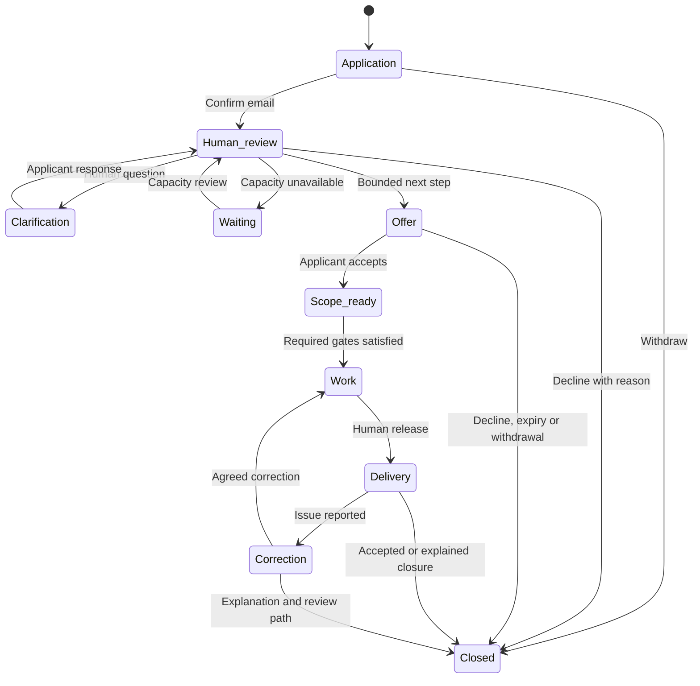

# Workshop lifecycle and operating blueprint

Design checkpoint: 8 October 2026. Owner: Christine, with explicitly delegated operators where a verified capability permits. This document is an operating design and release map, not a claim that every ecosystem component is live. Use the release evidence and current API contract for the exact deployed state. No private application, account identifier, signature, case record or operational secret belongs in this repository.

## Domain, scope and vision

**Domain:** public decision systems engineering, reusable document and evidence-organization tools, technical education, and bounded independent observation/review.

**Scope of this release:** complete the operational path from a minimal application through a human decision, a bounded next step, response, work tracking, delivery, correction and closure **for free public resources, fictional practice and orientation only**. The implemented lifecycle stores coordinating metadata; it does not establish paid or discounted private engineering delivery. An application or workflow state is not proof of the underlying facts, a secure case workspace, a legal engagement, a qualification, a payment, or permission to publish.

**Vision:** people can reach a useful next step without having to disclose their private circumstances publicly. Christine can see what needs attention, what has been promised, what capacity remains, and what has actually been completed. Reusable tools and education make assistance accessible while preserving engineering time for improving the pipelines.

The main path should answer five questions at every stage: **What happened? What happens next? Who acts? What is permitted? How can I correct or leave?**

## Stakeholders and control

| Stakeholder | Need | Authority boundary |
| --- | --- | --- |
| Applicant | Clear status, fair review, affordable options, withdrawal and correction | Controls their application choices; an application does not authorize sharing with volunteers |
| Learner or tester | Useful practice, accessible materials, factual feedback route | Chooses participation; assistance is not conditional on unpaid labor or public praise |
| Volunteer observer | Defined observation task, preparation and safety | Reports what they actually observed; receives only assignment-specific access |
| Independent reviewer | Domain fit, conflict disclosure, sources and a limited question | Evaluates the defined work; training or an account does not establish a legal credential |
| Christine / authorized operator | One actionable queue, sustainable workload, documented decisions | Human decisions within an explicit capability; no broad authority inferred from a job title |
| Engineer | Agreed inputs, hours, deliverable and acceptance conditions | Works within the current scope; material changes require renewed agreement |
| Person described in material | Privacy, accurate attribution and correction | Their information is not automatically available because another person applied |
| Public reader | Accurate release status, sources, limitations and corrections | Receives only an explicitly approved public version |

The existing platform's internal subject/tenant identity and scoped, revocable capability pattern should be reused. Its recipe-editing and engineering-metrics grants do not grant access to community applications. The contact registry is not an authenticated account registry.

## Priorities, in order

| Order | Priority | Heuristic that enforces it |
| --- | --- | --- |
| 1 | Protect people and preserve their control | Minimize fields; keep private records out of intake; explicit consent per purpose; fail closed on missing authority; withdrawal remains available during intake pauses |
| 2 | Make commitments and corrections traceable | Each consequential transition has a current state, actor, timestamp and permitted next action; do not silently overwrite an accepted scope |
| 3 | Deliver a useful, bounded outcome | Offer one specific next step with limits and acceptance conditions; separate request, offer, acceptance, work and delivery |
| 4 | Sustain access without exhausting the operator | Reserve capacity before commitments; pause or waitlist honestly; keep engineering, review, teaching and moderation budgets distinct |
| 5 | Learn and grow from observed results | Measure completed loops and failures with denominators; publish reviewed improvements after testing; broaden scope only when the next operating unit fits capacity |

Growth does not override a missing privacy, permission, competence or capacity gate. A queue may recommend the next item; it must not automatically judge eligibility or the truth of a person's account.

## Lifecycle map

The labels below are human-facing stages, not a substitute for the exact database/API state names.

Withdrawal or cancellation remains a separate permitted exit where applicable. Closing an application does not automatically cancel a separate service agreement, erase an audit record, unsubscribe a newsletter, or authorize public use. Such effects must be explicit and implemented in the corresponding system.

## Exact implementation contract

The following is implemented in the lifecycle source candidate. **Deployment, owner-grant activation and hosted acceptance are separate checks; consult the current release evidence before describing them as live.** The implementation is additive: the original application's email-confirmation states and newsletter choices remain separate.

| Record or operation | Exact current contract |
| --- | --- |
| Workflow stage | `queue`, `reviewing`, `clarification`, `waitlisted`, `declined`, `offered`, `accepted`, `in_progress`, `delivered`, `correction_requested`, `closed`, `withdrawn` |
| Owner decisions | Review; clarify a broad preference; waitlist; decline; issue a free next-step offer; start; provide a resource; resolve a correction; pause; close |
| Applicant actions | Clarify the requested preference; accept/decline a nonbinding offer; acknowledge receipt; give structured private feedback; request correction; request reconsideration; close. Original application withdrawal remains separate. |
| Clarification | One broad `service_interest`, or volunteer `availability`; no narrative or attachment |
| Offer | Versioned reference to one of four allowlisted public resources; proposed scope 15–120 minutes; expiry 1–30 days bounded by the private link's management expiry; price is always zero |
| Resource identifiers | `practice`: fictional practice cases; `tester_guide`: fictional testing guide; `learning`: learning resources/notices; `reviewer_orientation`: reviewer/observation orientation |
| Offer meaning | Nonbinding indication of interest. It is not an appointment, contract signature, paid order, credential, private record authorization or confirmed allocation of real engineering hours. |
| Offer state | `pending`, `accepted`, `declined`, `expired`, `canceled`, `completed`; at most one pending/accepted commitment per application |
| Capacity control | Configurable maximum concurrent commitments; the candidate defaults to 12, with the lifecycle gate closed. Counts accepted and unexpired pending offers. This is a safety cap, not measured throughput, a funded hour budget or a promise of available places. |
| Delivery | A numbered delivery reference matching the accepted offer's allowlisted resource. It does not store a custom artifact, guarantee completion of a professional service or establish that the referenced file is immutable. |
| Receipt and version | Receipt acknowledgement, feedback, correction and delivery events are bound server-side to the delivery version. The latest version may be acknowledged once; replay does not create another acknowledgement. Acknowledgement is receipt, not approval of accuracy. |
| Private feedback | Fixed choices: working `yes/partly/no`; broken `none/access/navigation/formatting/incorrect_information`; improvement `clarity/accessibility/speed/features/none` |
| Correction | Fixed category `access/formatting/incorrect_information/missing_resource`; a resolution creates another numbered delivery reference and preserves earlier delivery metadata. It may point to another allowlisted public resource. Closed applications with a delivery retain feedback/correction actions while their management link remains eligible. External case correction and legal outcomes are not represented. |
| Reconsideration | Eligible declined, waitlisted, closed or expired-offer requests may return to the queue within the existing private-link lifetime. It does not bypass human review. |
| Concurrency and audit | Expected revision and request identifier on changes; events identify actor type, action, timestamp and revision; conflicting retries/stale decisions are rejected. |
| Owner authority | Existing verified Supabase session created within the last 30 minutes and mapped to the internal identity, plus the exact active steward capability `community:applications:review` in scope `community:workshop`; authority is rechecked by the database. Other engineering grants are insufficient. |
| Queue | Active and archived views, bounded pages, total count and next-page indication; terminal records must not hide newer actionable requests. |
| Update notice | Fixed template `kapukai-application-update-v1-2026-10-08`, preview followed by explicit owner sending action; at most one notice per application revision. Receipt states are `claimed`, `accepted`, `failed`, `unknown`. Provider acceptance is not delivery. No automatic or repeated same-revision send. |
| Expiry maintenance | Bounded passes expire pending offers and release suppressed, withdrawn or management-expired commitments; stale claimed notices become unknown after ten minutes. No automatic eligibility, email, publication or deletion. A maintenance function is not evidence of a scheduled job. |
| Withdrawal | Cancels that application's pending/accepted commitments and synchronizes the workflow exit. It does not alter unrelated contact purposes. |

The owner queue does not need an email address to make bounded decisions. Application confirmations use the existing transactional mail flow. Lifecycle decisions themselves do not send email: the owner must separately preview and send the fixed update notice. The notice contains no application token or private case details; the applicant uses the original private link. A lost link therefore still needs the manual recovery path. Sending requires current authority, an eligible confirmed application, unsuppressed contact, unexpired management period, matching revision and an enabled gate. A provider receipt may be recorded against its already authorized claim even if the session expires during handoff. There is no automatic message campaign, notification SLA, retention/deletion job, public feedback publication, volunteer qualification or class reservation in this candidate.

Sources of truth: `community/backend/sql/workshop_lifecycle.sql`, its versioned migration, the `kapukai-workshop-ops` function and the current application/owner frontend. The next table describes the broader component contracts; its private-work and publication gates remain dependent work where the narrower contract above does not implement them.

## Functions and components

| Function | Component and minimum contract | Human gate |
| --- | --- | --- |
| Receive a request | Existing minimal application and purpose-specific confirmation token | Confirmation requests review only |
| Review | Restricted queue, bounded reasons, next action, recorded decision | Suitability, capacity and outcome chosen by an authorized person |
| Make a next-step offer | Versioned scope/limits, remaining charge where relevant, response route and expiry | No implied contract or payment; exact terms require their own accepted process |
| Respond | Application-scoped status and permitted response; no access to another applicant | Applicant chooses; opening a link does not accept anything |
| Coordinate work | Metadata for responsible person, current stage, agreed scope reference and capacity | Real processing starts only after the service's applicable gates |
| Deliver | Exact version/reference, responsible release decision and delivery/acceptance distinction | A generated file or provider send receipt is not accepted delivery |
| Correct | Issue category, affected version, assessed disposition, new version and closure reason | Human verifies the correction and any downstream notice |
| Close | Outcome, unfulfilled commitments, access/capacity release and retention review | No unrecorded disappearance or automatic permanent retention |
| Improve | Versioned observation and change proposal with test/release evidence | Human approves product changes; private content is not default training data |

Record types should remain separate: application, review, offer/work metadata, communication receipt, correction and publication permission. Their links establish provenance, not shared access. Keep operational notes bounded and structured rather than adding unrestricted narrative fields.

## Sustainable capacity and assistance

Use a **configurable 10% pro bono engineering ceiling** as a starting experiment, subject to a deliberately funded time budget. It is not a measured optimum, a promise to use the full allocation, a guaranteed award, or a hardcoded amount of available free help.

At each planning cycle, estimate the engineering hours actually available. Allocate existing commitments, product maintenance, testing, support and contingency. Then deliberately fund any assistance hours within that plan. A useful control is:

`new assistance hours available = max(0, min(10% × planned engineering hours, funded assistance budget) − already committed assistance hours)`

The planned-hour denominator and budget must be explicit. Log actual engineering hours separately to learn whether the estimate was realistic. The current concurrency cap and proposed offer minutes do **not** implement this hour-budget ledger. Volunteer, moderation and classroom hours are separate costs, not free substitutes for engineering capacity. If there is no current budget, state that individualized assistance is waitlisted; do not infer availability from the application being open.

Engineering remains **$250/hour** for separately agreed work. A discounted offer states both the normal scoped amount and the applicant's remaining charge before acceptance. A dollar package alone does not specify included hours, infrastructure, revisions or service availability.

Free tools and public learning resources may serve many people without an individualized award. Individual help must not require a testimonial, a public case story, newsletter enrollment, unpaid testing or other labor. Optional tool testing and feedback are independent opportunities, with their own consent and expectations. Self-reported need and a minimal fit/capacity review are preferable to collecting financial records in this system. No automated deservingness or credibility score is proposed.

## Volunteer and learning loops

Volunteer interest, training, eligibility and a particular assignment are distinct:

`application → orientation → fictional practice → human assessment → bounded eligibility → assignment offer → conflict check and sharing consent → accepted assignment → reviewed output → completion → access revoked`

Record the domain assessed, exercise/version, observed competency, limitations, assessor and review/expiry point when that qualification system is actually implemented. A course completion or applicant's profession does not establish expertise. Each assignment needs its own scope, conflict disclosure, participant consent, access period and output review. A reviewer may decline without losing unrelated community participation.

The existing First Circle plan already provides the learning path: choose an approved session → registration → confirmation → attend/practice → teach-back → optional feedback → improve the next session. Reuse that calendar, Zoom plan and existing content rather than creating another classroom or scheduling authority. No session date, instructor capacity, recording consent, registration integration or learner credential is established by this blueprint. A first session requires actual host, time, capacity, registration and attendee-delivery checks.

## Manual paths that must remain usable

These are operator procedures until a verified interface implements them. The public contact route is **architect@kapukai.org**. Ask for a request category and the minimum identifying information needed; never ask people to email case files, passwords or their private link token.

For an action not represented in the lifecycle controls, the existing private business-mail thread is the initial work record, not a new public form or an implied case-management product. Keep the thread limited to the request, verification result, next action/owner, decision and completion summary. Use an internal reference to the application only when access is authorized. Do not copy private material into source control or record the actual identity-verification secret. The operator can acknowledge receipt without promising an unmeasured response deadline: “We received your [request category]. Please do not send case files or your private link. We will check the request and tell you the next step.”

| Situation | Complete manual path |
| --- | --- |
| Lost or expired private link | Receive the request; verify control of the original contact through the approved process; locate only that application; explain current state and the supported recovery option; record resolution. Do not forward another person's token, change identity from an unverified message, or imply token rotation exists if it does not. A new deliberate application may be offered when recovery is unavailable, with duplicate handling reviewed by the operator. |
| Incorrect application preference | Verify the requester; record which bounded field is wrong; use the supported correction path or close and replace deliberately; preserve the fact that a correction occurred without retaining unnecessary old personal data. |
| Reconsideration | Record the requested review and the prior outcome; reassess fit/capacity using the stated criteria; disclose if the same operator performs it; provide a reason and next step. Another independent reviewer is not promised unless one is available, suitable and authorized. |
| Deletion/access request | Acknowledge; verify identity proportionately; identify application versus shared contact/consent records; determine what can be removed and what must be retained with its purpose; execute only the scoped authorized operation; explain completed, pending and retained items. Do not promise immediate removal from backups or providers without verifying it. |
| Capacity exhausted | Do not accept new commitments; offer an explicit waitlist, free resource or decline with reason; record the next review point; release capacity when work is cancelled/closed; tell an applicant when their next step changes. |
| Withdrawal during work | Stop new processing where possible; inspect any separately accepted scope and outstanding delivery/retention duties; revoke future access and unused commitments; explain residual obligations. An intake withdrawal is not a universal contract-cancellation mechanism. |
| Failed or uncertain notification | Inspect the provider receipt without exposing content; preserve an uncertain state; reconcile before resending; provide status through the valid private link or verified contact path. Provider acceptance is not inbox delivery. |
| Safety or misuse report | Restrict further exposure, preserve only necessary incident metadata, examine the reported behavior, apply a bounded response and give a review route. Do not publish identities or case narratives in incident reports. |

If a step lacks an authorized tool, retain an explicit pending action and owner rather than marking it complete. Set a realistic response expectation only after measuring available operating capacity.

### Broader loops and their concrete next actions

These loops are mapped so nothing ends in an ambiguous “coming soon.” They are **not all operational**. The next owner action creates a bounded planning or review record; it does not bypass the actual external gate.

| Loop | Start, finish, correction and exit | Next owner action and record | Actual gate before real use |
| --- | --- | --- | --- |
| Paid or discounted engineering | Inquiry → fit/capacity review → exact scope and quote → explicit agreement → authorized work → reviewed delivery → acceptance/closure. Changes return to a revised scope; correction requests identify the affected version. Cancellation follows the agreed terms. | Take one requested task and prepare the existing engineering statement-of-work draft with deliverable, hours, normal rate, any discount, remaining charge, completion criteria and correction limits. Keep it as an unaccepted draft in the private engagement record; use the business-mail thread for bounded coordination. Do not convert the free-resource offer into a charge. | Final operator/service terms, actual permitted private-data workflow, the document tool's current customer-processing release, and the existing payment/refund/delivery acceptance gate where payment is used. No paid availability is established here. |
| Volunteer competence and assignment | Application → orientation/practice → human assessment → limited eligibility → consented assignment → scoped access → reviewed observation/output → completion and access removal. Recusal, withdrawal, expired eligibility and correction all have exits. | Select one existing fictional practice exercise and its assessment criteria; invite the applicant to the free orientation/practice path only after the appropriate human decision. Record exercise version, whether a practice response was reviewed and the next training action privately. Do not label it a credential or give case access. | A competent assessor and defined domain/limits; conflict review; separate consent by the person seeking review and the volunteer; tested assignment-specific authorization, confidentiality, incident and revocation process. Real assignments and “expert” designations remain unavailable until these exist. |
| Class or webinar | Approved session → registration → private confirmation → attend/practice → teach-back → optional feedback → close session and review. Cancellation updates the event and informs registered people; corrected material retains its version. | Select the first session from the existing First Circle plan and resolve its title, time, host and capacity with the owner. Keep the proposed event unlisted until accepted. Then use the existing platform's event metadata record and authorized Zoom setup, not a second calendar. | Actual host/license and selected time, approved free/paid status, registration/confirmation test, accessibility, capacity and cancellation handling. Recording requires a separate choice. No event date or class seat is currently promised. |
| Public feedback or information release | Private submission → scope/rights/safety review → author approves exact public version and audience → human moderation/release → visible corrections → withdrawal/takedown handling within actual control. | Choose one non-sensitive, already permitted resource or fictional example; prepare its proposed public version and correction contact. Record source/version, intended audience, permission state and the human release decision. Private applicant feedback remains private until its separate release path exists. | Exact publication authorization, actual hosting/moderation controls, correction and appeal handling, and a tested way to update or remove the hosted copy. There is no automatic release to bills, news, research, social networks or other institutions. |
| Independent external review | A defined artifact/question → suitable reviewer and conflicts check → scoped evidence access → reasoned findings with limitations → response/correction → close and revoke access | Prepare a single fictional review question with a rubric that distinguishes source fidelity, completeness, uncertainty and unsupported claims. Keep the rubric a training/review draft; record what it actually measures. | Qualified reviewer for that domain, independence/conflict assessment, appropriate information-sharing permission and reliable access/revocation. Neither training nor a reviewer account confers governmental or judicial authority. |

An operator task for any of these loops should identify `purpose`, `current stage`, `next owner action`, `dependency`, `review point` and `closure reason`. Where an actual external provider or person is needed, record the unmet dependency and a contact/decision step. Do not record “complete” merely because a plan, template or software state exists.

## Operating cadence

- **Each working day:** inspect actionable requests, overdue commitments, failed notifications and urgent access/privacy issues; use one queue and owner per next action.
- **Twice weekly during the pilot:** make human application decisions, review waitlist capacity and prepare individually authorized replies. Batch routine work to protect engineering focus.
- **Weekly:** reconcile capacity, delivered-but-unaccepted work, corrections, revoked access and privacy requests; choose one concrete friction point to fix.
- **Each planning cycle:** compare actual hours/costs to the funded assistance allocation; review stale records and the real retention schedule; decide whether to continue, reduce, pause or expand the pilot.
- **Before each release:** verify critical transitions, authority, withdrawal, regression behavior, exact deployment and rollback. An operating pause must preserve existing status and withdrawal paths.

This is a proposed manual cadence, not a scheduled automation or guaranteed response time. Keep the pilot small enough that Christine can actually carry it out.

## Measurement and evaluation

Report a metric only when its necessary events exist. Label missing observations **unknown**, not zero or successful. Exclude private narratives, documents, legal claims and exact locations from telemetry.

| Question | Measure and denominator | Limitation or tradeoff |
| --- | --- | --- |
| Are requests reaching a person? | Confirmed applications with a recorded initial disposition (clarification, waitlist, decline or offer) / confirmed applications eligible for review; age of outstanding queue | Starting a review is not a disposition. A quick decline is not necessarily useful access; show outcome mix and queue age together |
| Do offers lead to useful next steps? | Accepted offers / offers issued; expired and declined counts | Current source records these transitions, but a dashboard calculation needs separate implementation/verification; acceptance is not work completion |
| Are commitments sustainable? | Committed assistance hours / funded assistance hours; actual engineering hours by purpose | Requires deliberate hour recording; administrative and moderation time must not disappear |
| Does work close? | Distinct acknowledged `(application, delivery version)` pairs / delivered `(application, version)` pairs; latest versions still unacknowledged; closure reason and open-correction age | Server-bound delivery versions and duplicate protection support this measure. A corrected delivery still needs its own receipt. Receipt is not acceptance of correctness or a professional deliverable. |
| Do corrections work? | Current correction requests followed by a numbered resolution / correction requests; reopened count; age | The current implementation records requested/resolved, not a separate accepted-for-correction decision or notification receipt. Broader resolved-and-notified metrics require those events. No local closure proves external correction. |
| Are choices respected? | Withdrawal operations completed; attempted actions denied after withdrawal; overdue privacy requests | “No incident reported” is not proof that no incident occurred |
| Is the system coherent? | State contradictions, missing handoffs and records lacking a responsible next action | Low counts may reflect missing detection; publish test coverage alongside results |
| Is coupling manageable? | Dependencies required for a transition; blocked transitions by failed component; tested behavior during a mail/intake pause | Fewer components are easier to run; total consolidation can increase blast radius |
| Is the experience understandable? | Optional task-completion check and structured “what was unclear?” feedback | Satisfaction is not evidence accuracy, qualification or legal outcome |
| Is learning improving the system? | Repeated defects by version, reviewed changes shipped, regression recurrence | Test volume alone is not quality; focus on high-impact failure paths |

Use **coherence** for agreement between declared rules, actual state and observed behavior. Use **coupling** for dependencies and failure propagation. “Resonance” and “dissonance” may describe alignment or friction in participant feedback; they are not scientific credibility scores or evidence that someone's account is true.

## Ecosystem map and release boundaries

| Element | Role | Established baseline | This lifecycle work or dependent gate |
| --- | --- | --- | --- |
| Public Workshop | Shared navigation and entry point | Vercel Workshop pages and application front doors were released and checked on 8 October | Exact new release must be verified separately |
| Interest signup | Purpose-specific updates | Confirmation/withdrawal with separate email purposes | Does not create accounts, membership or assistance approval |
| Assistance / volunteer intake | Minimal private human-review request | Real owner-controlled confirmation and withdrawal passed | Candidate implements human decision, response and public-resource work metadata; hosted acceptance is recorded separately |
| Owner operations | Review, capacity, work and closure | Original version used restricted administrative queries | Candidate adds an authenticated owner route; its explicit capability and hosted denial/acceptance checks remain release gates |
| Existing document tools | Controlled preparation and engineering | Separate platform, identity, product and release evidence | Workflow metadata cannot enable private processing, paid delivery or new entitlements |
| First Circle / classes | Learning, practice and feedback | Existing calendar/operating plan and fictional resources | A dated session still needs host approval and real registration acceptance |
| Volunteer qualifications | Bounded competence and assignments | Applications only; no new credentials established | Training, assessment, conflicts, sharing consent and access revocation remain separate |
| Feedback / correction | Learn from actual use | Candidate records fixed private feedback choices and resource-correction requests/resolutions | No free-text case feedback or public review publication; public reviews need separate consent, moderation, release and correction paths |
| Adobe / agreements | Appropriate execution and evidence retention | Draft packet only; no signing acceptance established | Final terms, jurisdiction/use requirements and actual signing tests are required |
| Canonical kapukai.org | Consistent public addresses | Existing nginx site; Vercel access does not confer host access | Install the tested release with backup; verify approved public mailing address before publication |
| Commons, initiatives, release desk | Future voluntary information-sharing models | Exploration packet | Not launched by application or work-state changes |
| Federation, trusts, tribunals | Possible future governance research | Exploration only | No legal entity, judicial authority, arbitration system or technical federation is created |

## Risks, benefits and tradeoffs

One reusable lifecycle reduces duplicated forms and makes responsibility visible, but must not couple newsletter consent, service access and public release. Minimal fields reduce privacy exposure and review burden, but may require a later carefully scoped clarification. Token links reduce account friction, but anyone possessing a valid link has its narrow permissions; keep tokens out of logs and provide a verified recovery path. Human review prevents an opaque eligibility score from deciding people's access, but creates a queue that needs capacity and an honest waitlist.

A small shared standard for volunteer work helps consistency without claiming expertise the organization has not assessed. Decentralized work can widen participation, but distributed private records, moderation and credential claims would multiply risks before the basic operating loop is stable. Keep that expansion out of this release.

Public feedback can reveal failures, but publication must not expose an applicant or become a condition of receiving help. Moderate targeting and abuse by behavior, preserve the ability to publish legitimate criticism, and make corrections to approved public versions traceable.

## Remember, learn, adapt and correct

1. Record the exact rule/version, observed failure or success, scope and evidence boundary. Separate a person's report from a verified product defect.
2. Identify the smallest change likely to resolve the cause, its dependencies, who benefits and what could worsen.
3. Prepare a versioned proposal. Do not train on private applications or narratives by default.
4. Test the affected lifecycle and its important failure/withdrawal paths. Preserve evidence of what remains untested.
5. Obtain the applicable human release decision, deploy and verify the exact version, then observe whether the problem recurs.
6. Correct the documentation, route, workflow and known affected recipient versions where authorized. Never imply that a local correction automatically propagates to an outside agency.

Expand after a bounded assistance path, volunteer practice path, learning session and correction loop have completed with measured workload that fits the operator's capacity. Completion of one loop is evidence about that loop, not proof of scale or authority over other systems.

## References within the work

- `docs/community-applications.md`: original intake, token, privacy and operational boundaries.
- `docs/LIVE_RELEASE_2026-10-08.md`: baseline published entry/application verification.
- `docs/LIFECYCLE_QA_2026-10-08.md`: lifecycle-specific checks and limits as recorded by QA.
- Existing platform `docs/FIRST_CIRCLE_CONTINUITY.md`, `docs/operations/WEBINAR_PILOT_AND_EA_HANDOFF.md` and `docs/operations/WEBINAR_CALENDAR.md`: shared identity, existing learning plan and actual event gate. These are references to the separate platform; this repository does not replace it.
