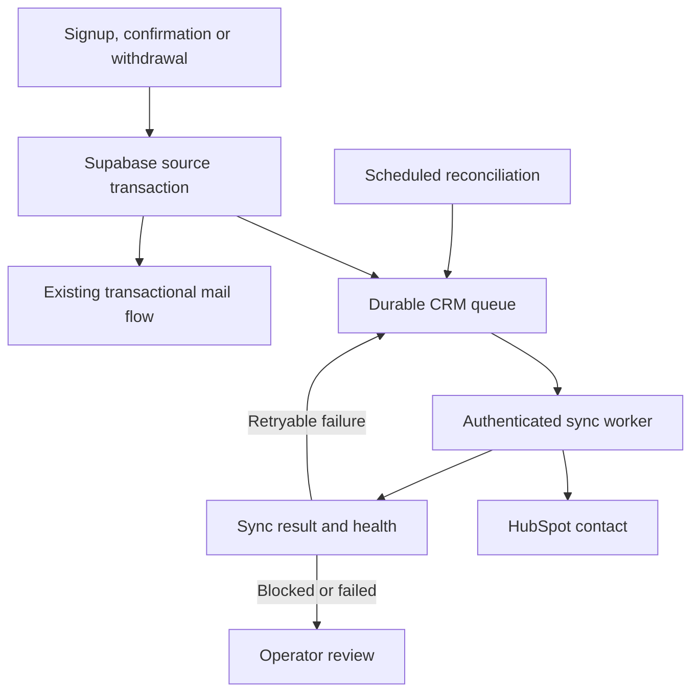

# Kapukai signup → HubSpot blueprint

Release candidate: October 10, 2026. This document covers the contact and signup lifecycle. The release evidence below determines what is actually live; a design or a passing local test is not proof that production is connected.

## Outcome and ownership

Every eligible signup stored by the covered Supabase sources produces one contact relationship in HubSpot, matched by normalized email. Supabase keeps the authoritative signup, confirmation, preferences, withdrawal and account records. HubSpot receives a limited, current summary for contact management. Postmark continues the existing transactional confirmation service.

Creating a CRM contact does **not** grant marketing permission, membership, assistance, reviewer status, classroom access, qualifications or a certificate. The integration does not send a campaign or change HubSpot marketing subscription settings. A confirmed account email is not newsletter consent.

| System | Owns | Must not be treated as |
| --- | --- | --- |
| Kapukai pages and signup APIs | User interaction, validation and existing confirmation links | A second CRM |
| Supabase | Identity, source-specific consent and operational records; durable sync queue | An unreviewed marketing list |
| HubSpot | Contact relationship, current Kapukai summary and human follow-up | The authority for Kapukai access or consent |
| Postmark | Existing transactional mail handoff | Proof that a recipient received or read a message |

## Source coverage

Database triggers provide coverage at the shared backend. Adding a HubSpot request to each public page would miss older pages, direct API submissions and later lifecycle changes.

| Signup family | Source of current truth | CRM meaning |
| --- | --- | --- |
| Legacy interest signup | `public.kapukai_interest_registry` and `public.kapukai_interest_confirmations` | Legacy interest and its own status; confirmation expiry and applicable suppression remain effective |
| Join, testers, newsletter, volunteering, free-class notices and connection topics | Registry identity plus `public.kapukai_scoped_intents` and `public.kapukai_scoped_subscriptions` | Requested topics are pending until confirmed; current subscriptions determine active topics |
| Community assistance, reviewer and witness applications | `public.kapukai_applications` and `public.kapukai_workshop_workflows`, linked to the registry | A general application relationship and fixed workflow stage; application type, reasons and private details are omitted |
| Public Systems Assurance | `public.assurance_connections` | Separate confirmed topic preferences or a contact-only inquiry; no message body |
| Earlier connection flows | `public.kapukai_connections` and `public.kapukai_connection_requests` | A connection request and its own state; no inquiry or case narrative |
| Platform registration | `auth.users` trigger → `private.kapukai_crm_accounts` | Account email and confirmation state only; the CRM service reads the minimal private projection without gaining broad access to `auth.users` |

The active community signup destination is `https://kapukai-community.vercel.app/join/#signup`. The classroom and learning pages currently link to this interest flow. A free-class interest is **not** an enrollment. Existing private confirmation fragments must remain usable.

Any future signup table or separate Supabase project must be explicitly added to the source projection, trigger list and tests. “All signups” here means the enumerated sources in project `tbxfsjipkrdwyctepesf`; it is not a claim that unrelated systems are automatically discovered.

## Contact identity and the data boundary

- Normalize email by trimming and lowercasing, consistent with existing signup handling. Do not collapse plus-addresses or remove dots, and do not infer that two different addresses belong to one person.
- Store the HubSpot contact ID locally after a successful create or match. Check the current mapping and primary email before updating. A secondary-email-only match is an identity conflict for human review, so two independent email identities cannot overwrite one merged contact. On an ambiguous create response or a duplicate conflict, look up the email again before attempting another create.
- Update only integration-owned Kapukai properties. Preserve human notes, ownership, deals, existing names and unrelated HubSpot fields. Do not assign a sales lifecycle stage merely because someone filled in a free signup form.
- Mirror source names, source-specific lifecycle summaries, confirmed topic names, suppression state and sync metadata. The property contract is defined by the worker; do not accept arbitrary database JSON as CRM properties.
- Never mirror passwords, access tokens, private link tokens or hashes, IP fingerprints, case details, assurance messages, uploaded files, application narratives, financial proof or child-related records.
- Reserved synthetic domains are filtered automatically. Other known test records must be explicitly excluded before external backfill delivery. A hash-based exclusion prevents reconciliation from recreating an excluded contact. Do not classify a real person as a test merely from an unfamiliar address.

The legacy registry can remain `pending` while scoped topics are confirmed. The integration must read the scoped subscriptions rather than treating the registry status as the only source of consent. Topics stay namespaced by source so two separate consent purposes cannot accidentally become a global opt-in.

The worker `community/backend/supabase/functions/kapukai-hubspot-sync/handler.mjs` owns these twelve contact properties. They are text fields to keep the schema small; timestamps use ISO 8601, booleans use `true`/`false`, and source/topic/state sets use a sorted semicolon-separated list.

| HubSpot property | Meaning |
| --- | --- |
| `kapukai_signup_sources` | Current participating signup families |
| `kapukai_source_states` | Fixed state tags prefixed `identity:`, `legacy:`, `preferences:`, `application:`, `assurance:`, `connection:`, `connection_request:` or `account:`; includes Workshop stage without application type or reasons |
| `kapukai_confirmed_topics` | Current source-qualified confirmed topics, honoring each source's suppression scope; empty for an excluded or removed projection |
| `kapukai_consent_status` | Summary: `pending`, `expired`, `confirmed_topics`, `contact_only`, `withdrawn`, `suppressed` or `removed`; not a HubSpot subscription |
| `kapukai_email_verified` | At least one current source records email confirmation; not marketing permission |
| `kapukai_latest_signup_at` | Latest source signup timestamp |
| `kapukai_latest_withdrawal_at` | Latest recorded withdrawal timestamp available in the supported source records |
| `kapukai_source_present` | Whether an eligible source remains after exclusions |
| `kapukai_suppressed` | Conservative suppression summary; individual source consent remains in Supabase |
| `kapukai_sync_generation` | Local projection generation written to this contact |
| `kapukai_supplied_name` and `kapukai_supplied_company` | Latest supplied contact details from supported sources, kept separate from human-managed standard CRM fields |

## Lifecycle behavior

| Event | Supabase result | HubSpot behavior and boundary |
| --- | --- | --- |
| Signup submitted | Existing validation, rate limits and source record; queue change in the same database transaction | Create or update a pending contact summary asynchronously |
| Confirmation requested | Existing transactional Postmark flow | Do not report accepted mail as confirmed email |
| Explicit email confirmation | Existing source-specific confirmation operation | Refresh the current confirmed status and applicable topics |
| Confirmation window expires | Existing token becomes unusable; expiry may occur without a database update | Scheduled reconciliation projects expiry so CRM does not remain falsely pending forever |
| Preference or source change | Source records retain their established consent rules | Recompute the complete current summary; do not append stale grants |
| Topic withdrawal | Relevant subscriptions are withdrawn | Clear the withdrawn topic from active CRM summary; retain any independently valid purpose |
| Application review, offer, delivery, correction, withdrawal or closure | Existing application/workflow rules continue; workflow changes enqueue a refresh | Reflect the recorded fixed stage, without copying decision reasons, deciding anything or sending mail |
| Global registry suppression | Existing suppression blocks the applicable legacy/scoped actions | Display suppression; do not turn another signup into permission to resume mail |
| Later reconfirmation | Only an allowed, valid new source confirmation can restore that purpose | Update from current source truth; an older pending token must not undo a newer choice |
| Email correction | Reconcile old and new normalized addresses | No automatic cross-address merge; review existing contact associations before a human merge |
| Source row deletion | Queue the affected identity, including its old email | Recompute any remaining purposes. A no-source tombstone must not create a contact. A later legitimate signup can establish a new source unless explicitly excluded |
| Privacy deletion or permanent exclusion | Explicit operator process plus a persistent exclusion tombstone | Mark an existing contact suppressed and clear imported sources, topics, names and dates, then remove the raw-email queue row after acknowledgement while retaining the exclusion hash and CRM ID. Prevent resurrection. CRM erasure is a separate verified action; withdrawal alone is not erasure |

Deleting a source record is not by itself a complete deletion workflow. A verified deletion request requires checking Supabase, HubSpot, mail-provider records and applicable retention decisions, recording completion without retaining unnecessary personal content, and preserving only the minimum suppression evidence needed to prevent accidental re-import. This release must not be described as automatic cross-system erasure unless that workflow is separately implemented and tested.

## Queue, retries and recovery

The migration `community/backend/supabase/migrations/20261010162458_signup_crm_outbox.sql` defines `public.kapukai_crm_outbox` and service-only operations. One queue row per normalized email coalesces repeated source changes. Source triggers enqueue both old and new email when the address changes. A generation counter and lease identify the exact work being processed.

The companion `20261010162830_signup_crm_schedule.sql` defines `kapukai-crm-worker-every-minute` and `kapukai-crm-reconcile-every-15-minutes`. Dispatch targets `https://tbxfsjipkrdwyctepesf.supabase.co/functions/v1/kapukai-hubspot-sync` and runs only when the CRM configuration is enabled. Reconciliation also refreshes unchanged synchronized contacts after 24 hours to observe contact-level HubSpot opt-outs and missing contacts.

The `kapukai-hubspot-sync` worker handles at most ten contacts sequentially per invocation and claims each contact just before processing it. It uses a 120-second lease, a 90-second HubSpot-work budget and at most ten seconds for each remote request. It builds a fresh projection from authoritative records, checks the lease/generation before its write, and records its result. If a source changes during an in-flight request, the newer generation remains pending. A successful remote contact ID is checkpointed even when a newer generation needs another update. A separate read verifies all owned properties before completion. Delivery is at least once; contact matching makes replay safe. There can be a short period where HubSpot is behind Supabase; a CRM field must never authorize a send or access grant.

| Result | Recovery |
| --- | --- |
| Successful write | Persist HubSpot ID, synchronized generation and successful timestamp |
| Network failure, timeout, rate limit or server error | Retry from 30 seconds with exponential delay, up to a six-hour base plus 20% jitter; honor `Retry-After` up to 24 hours, including a shared cooldown preserved across healthy heartbeats. Re-resolve an uncertain create before creating again |
| Missing credential or authorization scope | Expose the integration failure and preserve queued work; a claimed record can be marked blocked. Keep signup capture working |
| Invalid property or permanent request failure | Preserve a visible failed row and safe error category for operator repair and replay |
| Worker stops during a lease | Lease expiry permits recovery; a stale worker cannot acknowledge a newer generation |
| Source or timed state drifts from CRM projection | Scheduled reconciliation requeues changed identities |
| Mapped contact deleted or merged in HubSpot | Block as `CONTACT_MISSING` or `CONTACT_IDENTITY_CONFLICT` for review; do not recreate automatically or bypass a permanent exclusion |

Health exposes enabled/configured state, last worker heartbeat, pending/retrying/blocked/failed counts, oldest due work, last successful synchronization, shared retry cooldown and safe error categories. An available health query is not an alert delivery system. Until an alert destination is explicitly configured and verified, the owner must review health directly. Do not put emails, access tokens or raw provider response bodies in public logs.

Service-only operations are `kapukai_crm_health`, `kapukai_crm_heartbeat`, `kapukai_crm_reconcile`, `kapukai_crm_retry` and `kapukai_crm_exclude`; worker operations are `kapukai_crm_authorize_worker`, `kapukai_crm_claim`, `kapukai_crm_lease_current`, `kapukai_crm_checkpoint` and `kapukai_crm_complete`. The protected worker `GET` returns aggregate health, while `POST` attempts queued work. RLS and explicit grants deny these tables and operations to anonymous and ordinary signed-in users.

## Consent and inbound HubSpot changes

This release is primarily a Supabase-to-HubSpot relationship mirror. The worker also reads HubSpot's contact-level `hs_email_optout` and stores that suppression separately; scheduled refresh is needed to observe a later change. This is a safety signal, not full two-way subscription synchronization. HubSpot subscription-type changes, contact merges, manual CRM edits and deletion requests are not automatically authoritative Supabase writes merely because the contact is connected.

No outbound marketing automation is enabled by this release. Before activating one, implement and verify the precise subscription-type mapping, signed inbound event handling or reconciliation, and conflict rules. A safe sender must consult current scoped permission and all applicable suppressions immediately before sending, including a HubSpot opt-out where HubSpot is used for the send. A CRM editor checking a property must never be sufficient to opt someone back in. Existing transactional messages retain their existing, bounded purpose.

## Secure activation

Target HubSpot account: `245840109`. Target Supabase project: `tbxfsjipkrdwyctepesf`.

1. Review the worker's owned-property definitions and the migration; run the isolated backend tests and inspect the source coverage list. Do not reapply historical schema files.
2. Use a dedicated HubSpot **Service Key**, named **Kapukai Signup Sync**, in the target account. The current documented path is Development → Keys → Service keys. The contact runtime requires `crm.objects.contacts.read` and `crm.objects.contacts.write`. Property setup also requires `crm.schemas.contacts.read` and `crm.schemas.contacts.write`. Grant no marketing-send or unrelated record scopes. HubSpot is retiring new legacy private-app creation; do not depend on that old UI being available. Service Keys support the REST calls used here, not webhook authentication.
3. An authorized administrator enters the key directly into Supabase Edge Function Secrets as `KAPUKAI_HUBSPOT_ACCESS_TOKEN`. Do not paste it into chat, Git, a public `.env`, a frontend build or an API response. ChatGPT's HubSpot connection does not supply a deployable server credential. Do not use the old `HUBSPOT_ACCESS_TOKEN` or `HUBSPOT_PRIVATE_APP_TOKEN` names: an existing legacy function consumes those names and could activate a separate direct-write path.
4. Deploy both reviewed migrations and the `kapukai-hubspot-sync` worker while the CRM configuration remains disabled. The scheduler uses the dedicated `kapukai_crm_worker_token` generated and stored in Supabase Vault; `kapukai_crm_authorize_worker` validates the request against its stored hash. Production has no environment-token override and needs no second manually copied Edge secret. The browser's public Supabase key must not authorize queue access.
5. Set `KAPUKAI_HUBSPOT_PORTAL_ID=245840109` (also the code default), verify that the Service Key can access the account identity endpoint, and verify all required custom properties. Each worker run checks `/integrations/v1/me` against that expected account before contact writes; inability to verify must block activation. Then verify a controlled owner contact through create/match, confirmation, withdrawal and replay. Confirm that there is only one contact and that unrelated HubSpot fields and marketing subscriptions were not changed.
6. Review existing identities and explicit test exclusions, then perform backfill through the same queue. Enable the scheduled worker and reconciliation, confirm both run, and inspect blocked/failed rows. Count parity alone does not prove the correct identities or consent states.
7. Publish the exact tested signup/privacy disclosure on Vercel. Follow `AGENTS.md` for any later kapukai.org installation; Vercel access does not provide access to the existing nginx host.
8. Record the evidence below. Rotate the integration credential using the official provider process if it is exposed; verify recovery before considering the connection restored.

To pause CRM writes, disable the sync configuration or scheduler without disabling signup capture or deleting the queue. Repair and replay through the same worker. Avoid an emergency CSV import that skips exclusions and consent projection.

## Scope after this release

The result is a dependable contact record and signup-status mirror, not a completed learning management system. Course enrollment, progress, quiz attempts, certificates, institutional training requirements, payment reconciliation, refunds, paid access and authenticated student dashboards need their own authoritative event records and separate acceptance tests. Their future CRM summaries can use the same contact mapping, but are not present merely because this connector exists.

## Release evidence

Fill this section with observed results for the exact release. Until then, activation remains unverified.

| Evidence | Status / reference |
| --- | --- |
| Public website/backend Git commit and pull request | Pending |
| Migration applied and source triggers inspected | Pending |
| Worker deployment ID/version | Pending |
| Required credential and account verified without exposing secret | Pending |
| HubSpot properties verified | Pending |
| Existing backend/frontend regression results | Baseline: 87 backend tests and 10 frontend checks passed; final full suite pending |
| CRM database and worker test results | 11 database tests and 28 worker tests passed, including the real SQL RPC/PGlite pending → confirmation → withdrawal flow with a mocked HubSpot API. Deno entrypoint check passed; production CRM verification pending |
| Independent integration review | Mock-provider end-to-end review passed; no blocker found for deploying the disabled foundation. This is not live HubSpot evidence |
| Controlled contact create/match and contact ID | Pending |
| Confirmation, withdrawal, retry and duplicate replay verified | Pending |
| Backfill totals and synthetic exclusions | Pending |
| Cron and reconciliation execution observed | Pending |
| Health: last success, oldest pending, blocked and failed counts | Pending |
| Signup/privacy Vercel deployment and live routes | Pending |
| Platform signup/privacy candidate | [Kapukai platform PR #41](https://github.com/Kapukai/kapukai-platform/pull/41): three copy-only files; not deployed and no full-build claim |
| kapukai.org exact release installed | Pending; separate existing-host access required |
| Inbound HubSpot marketing opt-out synchronization | Contact-level opt-out readback implemented in the candidate; production verification pending. Subscription-type event mapping not implemented |
| Training, payment and certificate lifecycle | Not part of this release |

## Primary implementation references

- [Supabase Edge Function secrets](https://supabase.com/docs/guides/functions/secrets)
- [Supabase scheduling Edge Functions](https://supabase.com/docs/guides/functions/schedule-functions)
- [Supabase Vault](https://supabase.com/docs/guides/database/vault)
- [HubSpot contact object guide](https://developers.hubspot.com/blog/a-developers-guide-to-hubspot-crm-objects-contacts-object)
- [HubSpot properties API](https://developers.hubspot.com/docs/api-reference/legacy/crm/properties/guide)
- [HubSpot Service Keys](https://developers.hubspot.com/docs/apps/developer-platform/build-apps/authentication/account-service-keys)
- [HubSpot legacy private-app creation sunset](https://developers.hubspot.com/changelog/legacy-private-app-creation-sunset)
